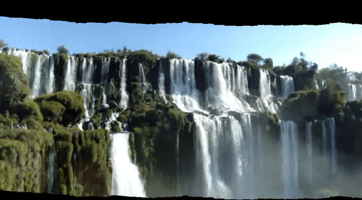

# Panorama Registration & Stitching
## Overview
This project was made as part of my studies of Image Processing course in the Hebrew University in Jerusalem.

In this project I implemented the "Stereo Mosaicking" algorithm. The input of such an algorithm is a sequence of images 
scanning a scene from left to right (due to camera rotation and/or translation -
we assume rigid transform between images).

The algorithm covers the following steps:
#### Registration 
The geometric transformation between each consecutive image pair is found by detecting Harris feature points, extracting their MOPS-like descriptors, matching these descriptors
between the pair and fitting a rigid transformation that agrees with a large set of inlier matches
using the RANSAC algorithm. 
#### Stitching
Combining strips from aligned images into a sequence of panoramas. Global motion will
be compensated, and the residual parallax, as well as other motions will become visible

## Usage Examples
#### Translation Example

#### Rotation Example

